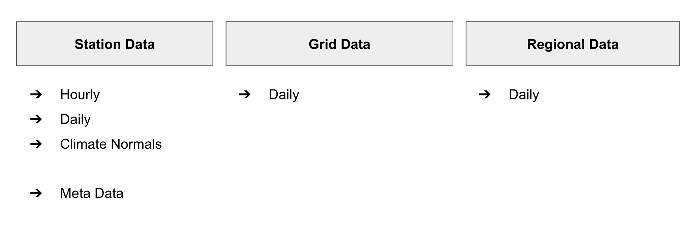

# Standard

## Portfolio



## Station Data

### Hourly Data

* TEMP: Air Temperature (2m)
* RHUM: Relative Humidity
* PRCP: Total Precipitation
* SNOW: Snow Depth
* CLDC: Cloud Cover (X/8)
* VSBY: Visibility
* WDIR: Wind Direction
* WSPD: Average Wind Speed
* WPGT: Peak Wind Gust
* PRES: Air Pressure (MSL)
* TSUN: Sunshine Duration
* SRAD: Global Solar Radiation
* COCO: Weather Condition Code

### Daily Data

* TAVG: Average Air Temperature
* TMIN: Minimum Air Temperature
* TMAX: Maximum Air Temperature
* RHUM: Average Relative Humidity
* PRCP: Total Precipitation
* SNOW: Max. Snow Depth
* CLDC: Average Cloud Cover (X/8)
* WDIR: Average Wind Direction
* WSPD: Average Wind Speed
* WPGT: Peak Wind Gust
* PRES: Average Air Pressure
* TSUN: Total Sunshine Duration
* SRAD: Global Solar Radiation

## Interfaces

### Bulk Data

Station Data:

```
https://bulk.meteostat.net/stations/hourly/10637.csv.gz
https://bulk.meteostat.net/stations/hourly/10637.map.csv.gz
```

Grid Data:

```
https://bulk.meteostat.net/gridded/daily/tavg/2020-01-01.nc
```

Regional Averages:

```
https://bulk.meteostat.net/regional/daily/de.csv.gz
```

### JSON API

Meta Data:

```
https://api.meteostat.net/statiosn/meta/10637
```

Nearby Stations:

```
https://api.meteostat.net/statiosn/nearby?lat=50&lon=8
```

Time Series:

```
https://api.meteostat.net/stations/hourly/10637?start=2020-01-01&end=2020-01-03
```